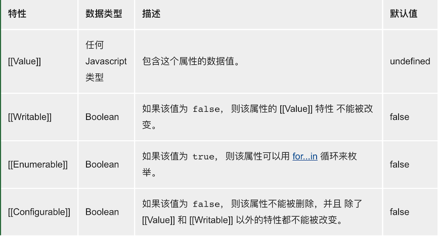
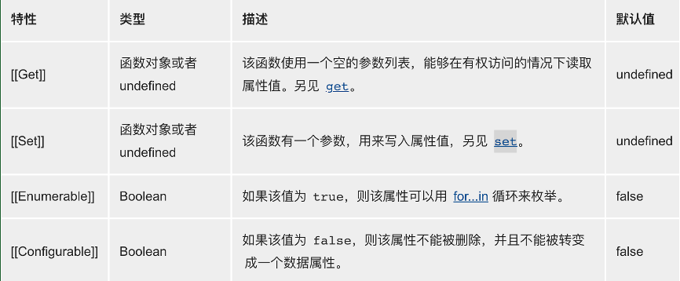

# JavaScript 数据类型和数据结构

## 动态类型

JavaScript 是一种**弱类型**的**动态**语言。JS 中的变量不会直接和数据类型关联起来，并且任何变量都可以被分配（重新分配）为所有类型的值。

## JS 数据类型

JavaScript 中的类型集由原始值和对象组成。

**最新的** ECMAScript（Europe Computer Manufactures Association）制定了 8 中标准数据类型：

- 7 种原始数据（非**对象**也无**方法**的数据）类型（使用 typeof 运算符检查）：

  1. undefined：typeof instance === ‘undefined’

     一个没有被赋值的变量会有个默认值 undefined

  2. null：typeof instance === ‘object’

     Null 类型只有一个值 null

  3. Boolean：typeof instance === ‘boolean

     表示一个逻辑实体，可以有两个值：true 和 false

  4. Number：typeof instance === ‘number’

     根据 es 标准，js 只有一种数字类型：基于 IEEE754 标准的双精度 64 为二进制格式的值（-（2^53 - 1）到 2^53 - 1）一位符号位（63），11 位指数位（62…52），52 位小数位（51…0）。它并没有为整数给出一种特定的类型，除了能表示浮点数外，还有一些带符号的值：+Infinity、-Infinity、NaN（Not-a-Number）

  5. String：typeof instance === ‘string’

     JS 中用于表示文本数据，它是一组 16 位的无符号整数值的“元素”。在字符串中的每个元素占据了字符串的位置。第一个元素的索引位 0，下一个为 1…。字符串的长度是元素的数量。

  6. Symbol：typeof instance === ‘symbol’

     是 ECMAScript（es2015）第六版新定义的。符号类型是唯一且不可修改的。并且也可以用来作为 Object 的 key。
     使用场景：

     a) 设置常量：symbol 唯一性

     ```js
     const TYPE_IMAGE = Symbol();
     const TYPE_VEDIO = Symbol();
     ```

     b) 模拟私有方法/属性：symbol 唯一性；Object.keys()以及 for in 循环不包含
     c) 全局共享值：通过键获取 symbol：Symbol.for()；通过 symbol 获取其 symbol 全局注册表（不同的 window 中保持一致，比如嵌入了 iframe）中的和 symbol 对应的键：Symbol.keyFor()

  7. BigInt：typeof instance === ‘bigint’
     可以用任意精度表示整数，可以安全的存储和操作大整数，甚至可以超出数字的安全整数限制。BigInt 整数末尾加 n 或者调用构造函数来创建。
     可以对 BigInt 使用像数字一样使用+、\*、-、\*\*、%运算符，但是不支持单目+运算。
     除>>>（无符号右移）以外的位运算符
     /运算向零取整。
     BigInt 严格来说并不等于一个数字，但它是松散的。即 2n === 2 为 false 但是 2n == 2 为 true。
     在将 BigInt 转换为 Boolean 时，它的行为类似于一个数字：if、||、&&、Boolean、！
     不能与数字互换操作，否则抛出 TypeError

- Object：typeof instance === ‘object’。

  任何 constructed 对象实例的特殊非数据结构类型，也用作数据结构：new Object、new Array、new Map、new Set、new WeakMap、new WeakSet、new Date 和几乎所有通过 new 关键词创建的东西。在 JS 中对象可以被看作是一组属性的集合。ECMAScript 定义的对象中有两种属性：数据属性和访问器属性。

  数据属性是键值对，并且每个数据属性拥有以下特性：

  

  访问器属性具有一个或者两个访问器函数（get 和 set）来存取数值。并具有一下特性：

  

  注意 ⚠️：这些特性只有 JavaScript 引擎采用到，因此你不能直接访问它们。所以特性被放在了两队方括号中，而不是一对。

  **“标准的” 对象，和函数**：一个 JS 对象就是键和值之间的映射。键是一个字符串（或者 Symbol），值可以是任意类型的值。

  **日期**：当你想要显示日期时，毋庸置疑，使用内建的 Date 对象。

  **有序集：数组和类型数组（Typed Arrays）**

  数组使用整数作为键属性和长度属性之间关联。此外还集成了 Array.prototype 的一些操作数组的便
  捷方法：indexOf、push 等等。类型数组是 es6 中新定义的。

  **键控集：Maps、Sets、WeakMaps、WeakSets**

  这些数据结构将对象的引用当作键。

  **结构化数据 JSON（JavaScript Object Notation）**

  是一种轻量级的数据交换格式，来源于 JS 同时也被多种语言所使用。

  **标准库中更多的对象…**

  JS 空对象判断方法：

  1. JSON.stringify(obj) === ‘{}’
  2. Object.keys(obj).length === 0 自身可枚举属性 key 的集合
  3. Object.getOwnPropertyNames(obj).length === 0 自身所有属性（包含不可枚举属性）key 的集合
  4. Object.prototype.hasOwnProperty 方法

  ```js
  function isEmptyObj(obj) {
    for (const key in obj) {
      // 遍历 obj 所有可枚举属性
      if (Object.prototype.hasOwnProperty.call(obj, key)) {
        // 检查 obj 自身属性
        return false;
      }
    }
    return true;
  }
  ```

- Function：非数据结构，尽管 typeof 操作的结果是 typeof instance === ‘function’这个结果是为 Function 的一个特殊缩写，尽管每个 Function 构造器都由 Object 构造器派生。

typeof 操作符的唯一目的就是检查数据类型，如果我们想要检查任何从 Object 派生的结构类型，typeof 操作符是不起作用的，因为它总是返回 object。

检查 Object 种类的的合适方式是使用 instanceof 运算符，但还是存在误差。原因在于 instanceof 是检查构造函数的 prototype 是否出现在某个实例对象的原型链上。

```js
function Car(make, model, year) {
  this.make = make;
  this.model = model;
  this.year = year;
}
const auto = new Car('Honda', 'Accord', 1998);

console.log(auto instanceof Car); // true

console.log(auto instanceof Object); // true
```

Car 的 prototype 出现在 auto 的原型链上；同样的 Object 的 prototype 也出现在了 auto 的原型链上（因为原型链的根是 Object.prototype）
